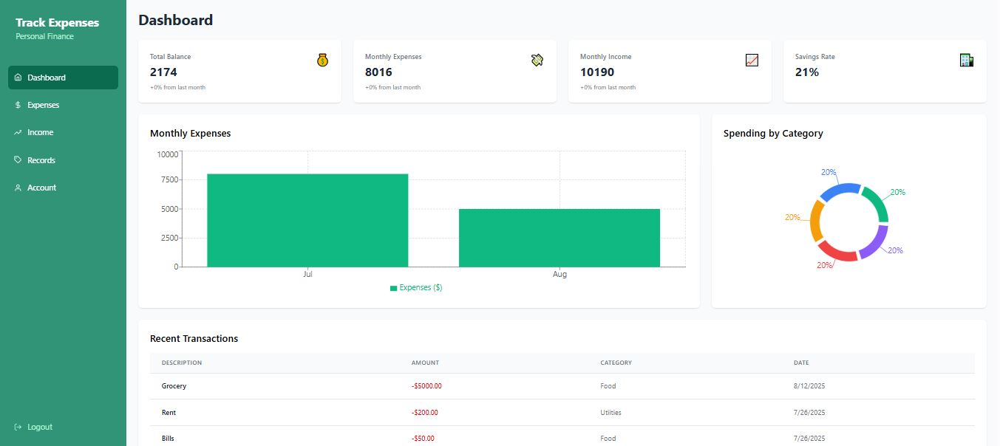
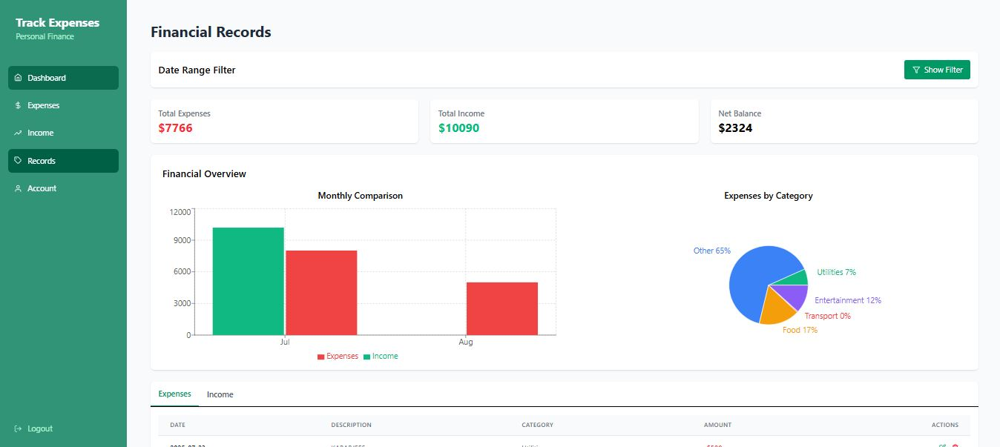
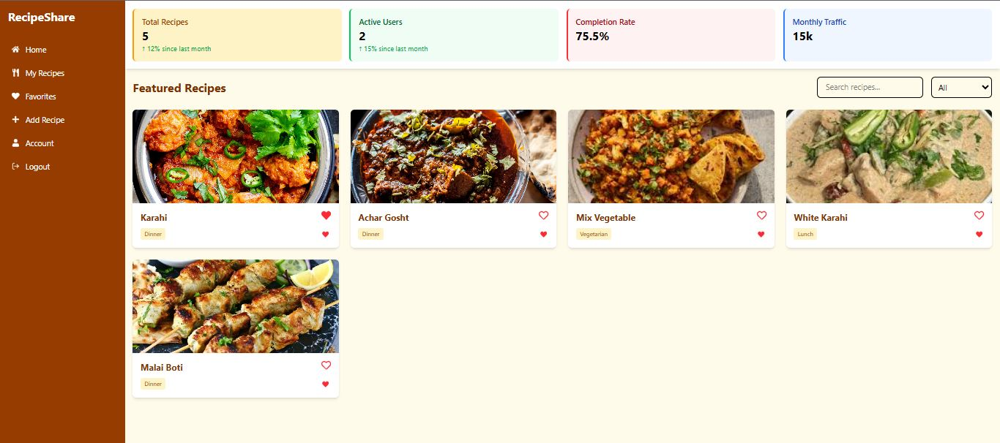

"# PORTFOLIO"

👋 Hi, I’m Abdullah — a Software Engineer.
💻 I build full-stack apps with React, Next.js, Node.js, Express, MongoDb and Supabase.
I enjoy solving real-world problems with clean, user-friendly solutions.  

PROJECTS:
📊 Expense Tracker App
A modern Expense Tracker built with React, Supabase, and Redux Toolkit to help users manage income, expenses, and credits (given/taken). Designed for both accounting and non-accounting users.

✨ Features:
📌 Add & categorize income and expenses
💳 Track credits (given & taken)
📈 Dashboard with visual reports and summaries
💾 Data persistence with Supabase backend
📱 Fully responsive design

🛠️ Tech Stack:
Frontend: React, Tailwind CSS
Backend: MongoDB & Express
Deployment Frontend: Vercel
Deployment Backend: Railway

📷 Screenshots:

🚀 FOR DEMO LOGIN:
email: umer@mailinator.com
password: 123456

👉 Expense Tracker Live:
DASHBOARD LINK: https://expense-tracker-smoky-nu.vercel.app/
FOR FRONTEND GITHUB: https://github.com/abdullah43123/EXPENSE-TRACKER
FOR BACKEND GITHUB: https://github.com/abdullah43123/EXPENSE-TRACKER-BACKEND

🍳 Recipe Sharing Website
A Recipe Sharing App where users can upload, explore, and save their favorite recipes. Built with React and Supabase to create a social, community-driven experience.

✨ Features:
👩‍🍳 Add new recipes with title, ingredients, steps & images
🔍 Search & filter recipes by category, cuisine, or name
❤️ Favorite recipes for quick access
🖼️ Upload recipe images (stored in Supabase storage)
📱 Fully responsive design

🛠️ Tech Stack

Frontend: React, Tailwind CSS
Backend: Supabase (Auth, Database, Storage)
Deployment: Vercel

📷 Screenshots

🚀 Live Demo
DEPLOY LINK: https://recipe-share-nkkl.vercel.app/

👉 Recipe Sharing Website
GITHUB: https://github.com/abdullah43123/RECIPE-SHARE
DEPLOY LINK: https://recipe-share-nkkl.vercel.app/

📬 Contact:
👤 Abdullah Aslam
GitHub: https://github.com/abdullah43123
LinkedIn: https://www.linkedin.com/in/abdullah-aslam-464a37229/
Email: aabdullahaslam91@gmail.com

